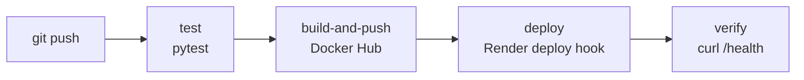

# Image Processing CI/CD Project

A Flask-based image processing service with Docker support and CI/CD pipelines.

## Endpoints

### `GET /health`
Returns the health status of the application.

```bash
curl http://localhost:5000/health
```

### `POST /resize`
Resizes an image to the specified width and height.

```bash
curl -X POST -F "image=@your_image.jpg" -F "width=200" -F "height=200" http://localhost:5000/resize --output resized.jpg
```

### `POST /compress`
Compresses an image to the specified quality (1-100).

```bash
curl -X POST -F "image=@your_image.jpg" -F "quality=50" -F "format=jpeg" http://localhost:5000/compress --output compressed.jpg
```

### `POST /convert`
Converts an image to the specified format (jpeg, png, webp).

```bash
curl -X POST -F "image=@your_image.png" -F "format=webp" http://localhost:5000/convert --output converted.webp
```

### `POST /grayscale`
Converts an image to grayscale.

```bash
curl -X POST -F "image=@your_image.jpg" http://localhost:5000/grayscale --output grayscale.jpg
```

## Usage Examples

All examples below are ready to copy and run. Run the image examples from a folder that contains a test image (see "Create test images").

### Run the tests

```powershell
pip install -r requirements.txt
pytest
```

### Run locally with Docker

```powershell
docker build -t image-processing-local .
docker run --rm -p 5000:5000 image-processing-local
```

Leave that window open and use a second terminal for the commands below. Stop the container with `Ctrl+C`.

### Choose which server to call

The same commands work against a local container or the deployed service. Set the base URL once per terminal session.

```powershell
# Local container
$BASE = "http://localhost:5000"

# Deployed service on Render
$BASE = "https://image-processing-service-wob4.onrender.com"
```

The Render free tier spins down when idle, so the first request after a pause can take up to a minute.

### Create test images

```powershell
python -c "from PIL import Image; Image.new('RGB',(400,300),'red').save('test.jpg')"
python -c "from PIL import Image; Image.new('RGBA',(400,300),(255,0,0,128)).save('test.png')"
```

`test.png` has transparency, which is useful for testing PNG to JPEG conversion.

### API calls (Windows PowerShell)

Use `curl.exe`, not `curl`. In PowerShell, plain `curl` is an alias for `Invoke-WebRequest` and does not accept these options. Each command prints the HTTP status and saves the result to a file.

**Health check**

```powershell
curl.exe $BASE/health
```

**Resize** (`image`, `width`, `height`)

```powershell
curl.exe -s -o resized.jpg -w "HTTP status: %{http_code}`n" -X POST -F "image=@test.jpg" -F "width=200" -F "height=200" $BASE/resize
```

**Compress** (`image`, `quality` 1-100, `format`)

```powershell
curl.exe -s -o compressed.jpg -w "HTTP status: %{http_code}`n" -X POST -F "image=@test.jpg" -F "quality=50" -F "format=jpeg" $BASE/compress
```

**Convert** (`image`, `format` of jpeg, png or webp)

```powershell
curl.exe -s -o converted.webp -w "HTTP status: %{http_code}`n" -X POST -F "image=@test.jpg" -F "format=webp" $BASE/convert
curl.exe -s -o from_png.jpg -w "HTTP status: %{http_code}`n" -X POST -F "image=@test.png" -F "format=jpeg" $BASE/convert
```

**Grayscale** (`image`)

```powershell
curl.exe -s -o grayscale.jpg -w "HTTP status: %{http_code}`n" -X POST -F "image=@test.jpg" $BASE/grayscale
```

### Check the results

```powershell
python -c "from PIL import Image; [print(f, Image.open(f).size, Image.open(f).format, Image.open(f).mode) for f in ['test.jpg','resized.jpg','compressed.jpg','converted.webp','grayscale.jpg','from_png.jpg']]"
```

Expected output:

| File | Size | Format | Mode |
|---|---|---|---|
| `resized.jpg` | 200x200 | JPEG | RGB |
| `compressed.jpg` | 400x300 | JPEG | RGB |
| `converted.webp` | 400x300 | WEBP | RGB |
| `grayscale.jpg` | 400x300 | JPEG | L |
| `from_png.jpg` | 400x300 | JPEG | RGB |

### Error handling examples

Invalid requests return a JSON error with HTTP status 400.

```powershell
# No image provided
curl.exe -i -X POST $BASE/resize

# Width is not an integer
curl.exe -i -X POST -F "image=@test.jpg" -F "width=abc" -F "height=200" $BASE/resize
```

Expected responses:

```json
{"error":"No image file provided in 'image' field"}
{"error":"width and height must be valid integers"}
```

Uploads larger than 5 MB are rejected with a JSON error as well.

### Bash (Linux and macOS)

```bash
BASE=http://localhost:5000

curl $BASE/health
curl -s -o resized.jpg -w "HTTP status: %{http_code}\n" -X POST -F "image=@test.jpg" -F "width=200" -F "height=200" $BASE/resize
curl -s -o compressed.jpg -w "HTTP status: %{http_code}\n" -X POST -F "image=@test.jpg" -F "quality=50" -F "format=jpeg" $BASE/compress
curl -s -o converted.webp -w "HTTP status: %{http_code}\n" -X POST -F "image=@test.jpg" -F "format=webp" $BASE/convert
curl -s -o grayscale.jpg -w "HTTP status: %{http_code}\n" -X POST -F "image=@test.jpg" $BASE/grayscale
```

### Notes

- Run these from a folder outside the repository, or delete the generated images afterwards, so test files are not committed by accident.
- Do not combine `-i` with `-o`. The response headers would be written into the image file and corrupt it.
- Use `https://` for the Render URL. A plain `http://` request is redirected and curl does not follow the redirect by default.

## CI/CD Pipeline

Every push to GitHub is automatically tested. Every push to `main` that passes is built into a Docker image, published to Docker Hub, deployed to Render, and verified with a live health check. No manual step exists between `git push` and the running service.

**Live service:** https://image-processing-service-wob4.onrender.com/health
**Docker Hub image:** `shail712/image-processing-service`

### Pipeline flow



The workflow is defined in `.github/workflows/cicd.yml`.

### Jobs

| Job | Runs on | What it does |
|---|---|---|
| `test` | every push, and pull requests to `main` | Checks out the code, sets up Python 3.12 with pip caching, installs `requirements.txt`, runs `pytest`. A failing test stops the pipeline. |
| `build-and-push` | push to `main` only, after `test` passes | Logs in to Docker Hub, builds the image with Buildx, and pushes it with two tags: `latest` and the full commit SHA. |
| `deploy` | push to `main` only, after `build-and-push` passes | Calls the Render deploy hook with the SHA-tagged image, then polls `/health` until the service reports healthy. |

Feature branches and pull requests run only `test`. They never build images or deploy.

### Image tagging

Each build is pushed twice:

- `shail712/image-processing-service:latest` is a moving label that always points at the newest build.
- `shail712/image-processing-service:<commit-sha>` identifies exactly one build.

The deploy job uses the SHA tag, so the version running in production can be traced to a specific commit and rolled back precisely. The same SHA appears in GitHub, on Docker Hub, and in Render's deploy events.

### Render deployment

The service is an image-backed Render web service. Render does not build anything. It pulls the image the pipeline already tested and pushed.

| Setting | Value |
|---|---|
| Service type | Web Service (deploy an existing image from a registry) |
| Image | `docker.io/shail712/image-processing-service:latest` (public) |
| Instance type | Free |
| Environment variable | `PORT=5000` |
| Health check path | `/health` |

Render does not redeploy automatically when a new image is pushed to a registry, so the pipeline triggers it with a **deploy hook**. The workflow appends an `imgURL` parameter to the hook so Render deploys the SHA-tagged image instead of `latest`.

`PORT=5000` tells Render which port to route traffic to. The container already listens on `0.0.0.0:5000` through gunicorn, so the Dockerfile did not need to change.

### Deployment verification

A successful call to the deploy hook only means Render accepted the request. The final step of the `deploy` job therefore waits 30 seconds, then calls `/health` up to 20 times, 15 seconds apart, and checks that the response body contains `"status":"healthy"`. If it never does, the job fails and the pipeline shows red. The retries cover Render's free-tier cold starts, which can take about a minute.

### GitHub secrets

Stored under Settings > Secrets and variables > Actions. Values are never committed to the repository.

| Secret | Purpose |
|---|---|
| `DOCKERHUB_USERNAME` | Docker Hub login and image namespace |
| `DOCKERHUB_TOKEN` | Docker Hub access token (Read & Write) |
| `RENDER_DEPLOY_HOOK` | Render deploy hook URL, which acts as a trigger and a password |

### Running the demo

1. Make a small change, for example add `LABEL demo.version="2"` to the `Dockerfile`.
2. Commit and push to `main`:

```powershell
git add Dockerfile
git commit -m "Demo: bump demo.version label to 2"
git push origin main
```

3. In the GitHub **Actions** tab, watch `test`, `build-and-push` and `deploy` run in order.
4. On Docker Hub, a new tag matching the commit SHA appears.
5. In the Render dashboard under **Events**, a new deploy appears, triggered via Deploy Hook, referencing the same SHA.
6. Verify the deployed image:

```powershell
$sha = git rev-parse HEAD
docker pull shail712/image-processing-service:$sha
docker inspect --format '{{json .Config.Labels}}' shail712/image-processing-service:$sha
curl.exe -i https://image-processing-service-wob4.onrender.com/health
```

To show the safety gate, push a branch with a deliberately failing test. The `test` job fails and nothing is built or deployed.

### Known limitations

- The health check proves the service is up and healthy, not that the new version is the one answering. During a deploy Render keeps the old instance serving until the new one is ready, so an early check could reach the old version. A stricter check would make `/health` return the commit SHA.
- The Render free tier spins down after inactivity, so the first request after idle can take 50 seconds or more.
- Auto-deploy is off by design. An image-backed service deploys only when the deploy hook fires.
- The service's configured image stays `latest`, so a manual "Deploy latest reference" in the dashboard deploys `latest`. The pipeline always deploys the SHA.

### Screenshots

Add these under `docs/screenshots/` and link them here:

1. Green GitHub Actions run with all three jobs
2. Red run from a failing test, showing the pipeline stops
3. Docker Hub Tags page showing `latest` and the SHA tag
4. Render Events showing a deploy triggered via Deploy Hook with the SHA
5. Render Settings showing the image, `PORT`, and health check path
6. `/health` response from the live URL