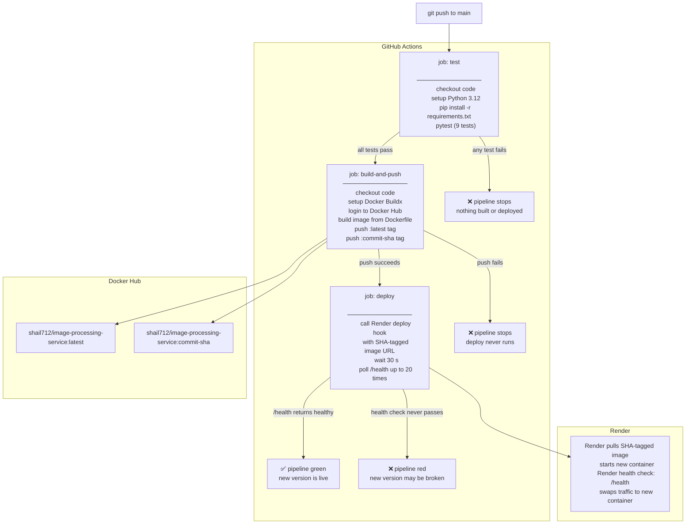

# Project Summary — Image Processing CI/CD

A plain-English walkthrough of everything in this repo, written for someone who is new to Flask, Docker, and CI/CD.

---

## 1. The Flask App (`app.py` + `image_processor.py`)

### What it is

The app is a small web API built with **Flask**. It receives an image file in an HTTP request, does some processing on it, and sends the processed image back. That's it — no database, no front-end, just an API.

### File size limit

Before any request reaches an endpoint, Flask checks that the uploaded file is not larger than **5 MB**. If it is, the app automatically returns a 400 error with a plain-English message.

### Endpoints

| Method | Path | What you send | What you get back |
|--------|------|---------------|-------------------|
| GET | `/health` | nothing | `{"status":"healthy"}` — used to check the app is alive |
| POST | `/resize` | image file + `width` + `height` | the same image resized to those pixel dimensions |
| POST | `/compress` | image file + `quality` (1–100) + `format` | the image re-saved at that quality level |
| POST | `/convert` | image file + `format` (`jpeg`, `png`, or `webp`) | the image converted to the new format |
| POST | `/grayscale` | image file | the image with all colour removed |

Every endpoint that needs an image goes through the same helper function `get_image_bytes()`, which reads the uploaded file and returns a clear error if nothing was uploaded or the file was empty.

### How image processing works (`image_processor.py`)

All four operations use **Pillow** (Python's standard image library). Each function follows the same three steps:

1. Open the raw bytes as a Pillow `Image` object.
2. Do the transformation (resize, re-save with quality, convert format, or convert to greyscale mode `"L"`).
3. Call the internal helper `_process_and_save()`, which writes the result into an in-memory buffer and returns the bytes plus the correct MIME type (e.g. `image/jpeg`).

One important detail in `_process_and_save()`: if the output format is JPEG and the image has an alpha channel (modes `RGBA`, `P`, or `LA`), Pillow automatically converts it to plain `RGB` first — because JPEG cannot store transparency.

### Tests (`tests/test_app.py`)

There are 9 pytest tests. They create small synthetic images in memory (no files on disk), call the Flask test client directly, and check the status code, MIME type, and — for resize and grayscale — the actual pixel dimensions and colour mode of the returned image. There are also tests for error cases: missing image, bad parameters, an invalid file disguised as an image, a 404, and an oversized upload.

---

## 2. Docker (`Dockerfile` + `requirements.txt`)

### What a container is (one sentence)

A container is a lightweight, self-contained box that has Python, all the libraries, and the app code baked in — so the app runs the same way everywhere.

### What the Dockerfile does, line by line

```
FROM python:3.12-slim
```
Start from an official Python 3.12 image. The `-slim` variant strips out things like compilers to keep the image small.

```
ENV PYTHONDONTWRITEBYTECODE=1  PYTHONUNBUFFERED=1
```
Two environment variables. The first stops Python from writing `.pyc` cache files (unnecessary inside a container). The second makes Python print log lines immediately instead of buffering them, so you see output in real time.

```
WORKDIR /app
```
All subsequent commands run inside the `/app` folder inside the container.

```
COPY requirements.txt .
RUN pip install --no-cache-dir -r requirements.txt
```
Copy just the dependency list first, then install it. This is a deliberate Docker trick: if you change only your app code and not `requirements.txt`, Docker reuses the cached layer where pip already ran, so rebuilds are much faster.

```
COPY . .
```
Copy the rest of the project (app.py, image_processor.py, etc.) into the container.

```
EXPOSE 5000
```
Documents that the app listens on port 5000. (This does not actually open a port — you do that with `docker run -p 5000:5000`.)

```
CMD ["gunicorn", "-b", "0.0.0.0:5000", "app:app"]
```
When the container starts, it runs **Gunicorn** (a production-grade web server) instead of Flask's built-in development server. `0.0.0.0` means "accept connections from any network interface", and `app:app` means "find the Flask object called `app` inside the file `app.py`".

```
LABEL demo.version="2"
```
A metadata label on the image. Has no effect at runtime; it is just a tag you can read with `docker inspect`.

---

## 3. GitHub Actions (`.github/workflows/cicd.yml`)

GitHub Actions is an automation service built into GitHub. Every time you push code, it reads this file and runs the jobs described in it.

### When the workflow runs

- **Any push to any branch** → runs the `test` job only.
- **Push to `main`** → runs `test`, then (if test passes) `build-and-push`, then (if that passes) `deploy`.
- **Pull request targeting `main`** → runs the `test` job only.

### Job 1 — `test`

Runs on every push and every PR.

Steps in order:
1. Check out the code from GitHub.
2. Install Python 3.12 (with pip caching so the second run is faster).
3. `pip install -r requirements.txt` — install Flask, Pillow, pytest, gunicorn.
4. `pytest` — run all 9 tests.

If any test fails, the job fails immediately and the whole pipeline stops. Nothing is built or deployed.

### Job 2 — `build-and-push`

Runs only on a push to `main`, and only after `test` succeeds (`needs: test`).

Steps in order:
1. Check out the code.
2. Set up **Docker Buildx** (the modern Docker build tool that supports multi-platform builds and better caching).
3. Log in to Docker Hub using the `DOCKERHUB_USERNAME` and `DOCKERHUB_TOKEN` secrets.
4. Build the Docker image from the `Dockerfile` and push it to Docker Hub with **two tags** (see section 4).

If the build or push fails, the pipeline stops and the `deploy` job never runs.

### Job 3 — `deploy`

Runs only on a push to `main`, and only after `build-and-push` succeeds (`needs: build-and-push`).

Steps in order:
1. **Trigger the deploy** — calls Render's deploy hook URL (a secret URL stored in `RENDER_DEPLOY_HOOK`) with an extra `imgURL` parameter pointing to the exact SHA-tagged image that was just pushed. Render accepts the request and starts pulling and running the new image.
2. **Verify the deploy** — waits 30 seconds for Render to start, then calls the `/health` endpoint up to 20 times (15 seconds apart). If the response contains `"status":"healthy"`, the job exits successfully. If after 20 attempts it never sees that, the job fails and the pipeline goes red.

### What happens if a job fails

| Failed job | Effect |
|------------|--------|
| `test` | Pipeline stops. Nothing is built or deployed. The old version keeps running. |
| `build-and-push` | `deploy` never runs. The old image stays on Docker Hub. The old version keeps running. |
| `deploy` (health check never passes) | Pipeline goes red. Render may have deployed the new image anyway — this means the new version is unhealthy and needs investigation. |

---

## 4. Docker Hub — Two Tags

Every successful `main` push produces two Docker Hub tags for the same image:

| Tag | Example | What it means |
|-----|---------|---------------|
| `latest` | `shail712/image-processing-service:latest` | Always points to the most recent build. Convenient for pulling the newest version without knowing the exact commit. |
| Commit SHA | `shail712/image-processing-service:a3f9c12...` | Points to exactly one build, tied to a specific commit in Git history. |

**Why two tags?** `latest` is easy to use day-to-day, but it moves — you cannot tell which commit it came from just by looking at the tag. The SHA tag is permanent and traceable. The pipeline deploys using the SHA tag so the exact version running in production can always be traced back to a specific commit and rolled back precisely.

---

## 5. Render — Hosting the App

**Render** is a cloud platform that runs Docker containers. The service is configured as an "image-backed web service", meaning Render does not build anything itself — it just pulls the already-tested image from Docker Hub and runs it.

### Key settings

| Setting | Value | Why |
|---------|-------|-----|
| Image | `shail712/image-processing-service:latest` | The public Docker Hub image |
| Environment variable `PORT=5000` | `5000` | Tells Render which port inside the container to route public traffic to. The container already listens on `0.0.0.0:5000` via Gunicorn. |
| Health check path | `/health` | Render calls this URL after every deploy. If it does not return 200, Render marks the deploy as failed and keeps the previous version live. |

### The deploy hook

Render does not watch Docker Hub for new images. Instead, it exposes a special **deploy hook URL** — a secret URL that, when called with an HTTP POST, tells Render "go deploy now". The GitHub Actions `deploy` job calls this URL and adds `?imgURL=<sha-tagged-image>` so Render deploys the exact SHA-tagged image rather than `latest`.

### Verification

Calling the deploy hook only means Render *accepted the request*, not that the deploy *succeeded*. So the `deploy` job then loops, calling `/health` every 15 seconds for up to 5 minutes, and only declares success when the health check passes. This catches cases where the new container crashes on startup.

---

## 6. Walkthrough — "I Change One Line and Push to `main`"

Here is the exact sequence of events, in order:

1. **You edit a file** and run `git push origin main`.

2. **GitHub receives the push** and reads `.github/workflows/cicd.yml`. It queues the workflow.

3. **`test` job starts** on a fresh Ubuntu runner (a temporary virtual machine in GitHub's cloud).
   - Python 3.12 is installed.
   - `pip install -r requirements.txt` runs.
   - `pytest` runs all 9 tests.
   - ✅ All pass → job succeeds and `build-and-push` is unlocked.
   - ❌ Any test fails → everything stops here.

4. **`build-and-push` job starts** on another fresh Ubuntu runner.
   - The code is checked out.
   - Docker Buildx is set up.
   - Logs in to Docker Hub with stored secrets.
   - Builds the Docker image from the `Dockerfile`.
   - Pushes it with two tags: `latest` and `<commit-sha>`.
   - ✅ Push succeeds → `deploy` is unlocked.

5. **`deploy` job starts**.
   - Calls the Render deploy hook URL, passing the SHA-tagged image as a parameter.
   - Render pulls the image from Docker Hub and starts replacing the running container.
   - The job waits 30 seconds, then polls `/health` until it gets `{"status":"healthy"}`.
   - ✅ Health check passes → pipeline is green. The new version is live.

Total time from `git push` to a live, verified deploy: roughly **3–6 minutes** (depending on Docker layer caching and Render's cold-start time).

---

## Pipeline Diagram



---

## Quick-Reference: Files and Their Roles

| File | Role |
|------|------|
| `app.py` | Flask app — defines all HTTP endpoints and error handlers |
| `image_processor.py` | All image operations using Pillow (resize, compress, convert, grayscale) |
| `tests/test_app.py` | 9 pytest tests covering success and error cases |
| `requirements.txt` | Python dependencies (Flask, Pillow, pytest, gunicorn) |
| `Dockerfile` | Instructions to build the Docker image |
| `.github/workflows/cicd.yml` | GitHub Actions workflow — the three-job pipeline |
